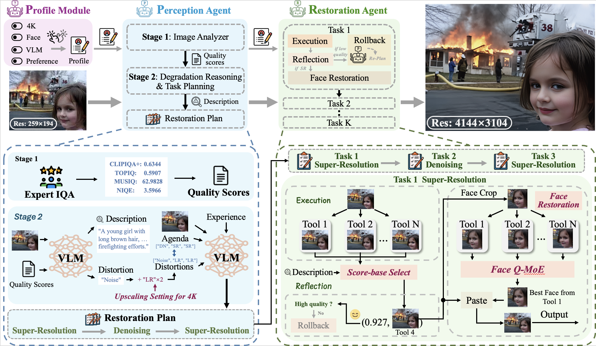

<div align="center">


<h1>4KAgent: Agentic Any Image to 4K Super-Resolution</h1>

<div>
    <a href='https://yushenzuo.github.io' target='_blank'>Yushen Zuo<sup>1</sup></a>&emsp;
    Qi Zheng<sup>1†</sup>&emsp;
    Mingyang Wu<sup>1†</sup>&emsp;
    Xinrui Jiang<sup>2†</sup>&emsp;
    <a href='https://shadowiterator.github.io' target='_blank'>Renjie Li<sup>1</sup></a>&emsp;<br>
    <a href='https://jianwang-cmu.github.io' target='_blank'>Jian Wang<sup>3</sup></a>&emsp;
    <a href='https://yzhang34.github.io/author/yide-zhang' target='_blank'>Yide Zhang<sup>4</sup></a>&emsp;
    <a href='https://gengchenmai.github.io' target='_blank'>Gengchen Mai<sup>5</sup></a>&emsp;
    <a href='https://coilab.caltech.edu/members/directors-biography' target='_blank'>Lihong V. Wang<sup>6</sup></a>&emsp;
    <a href='https://www.james-zou.com' target='_blank'>James Zou<sup>2</sup></a>&emsp;<br>
    <a href='https://www.xiaoyumu.com' target='_blank'>Xiaoyu Wang<sup>7</sup></a>&emsp;
    <a href='https://faculty.ucmerced.edu/mhyang' target='_blank'>Ming-Hsuan Yang<sup>8</sup></a>&emsp;
    <a href='https://vztu.github.io' target='_blank'>Zhengzhong Tu<sup>1*</sup></a>
</div>
<br>
<div>
    <sup>1</sup>Texas A&M University&emsp;  <sup>2</sup>Stanford University&emsp;  <sup>3</sup>Snap Inc.&emsp;  <sup>4</sup>CU Boulder<br>
    <sup>5</sup>UT Austin&emsp;  <sup>6</sup>California Institute of Technology&emsp;  <sup>7</sup>Topaz Labs&emsp;  <sup>8</sup>UC Merced<br>
    <sup>†</sup>Indicates Equal Contribution<br>
    <sup>*</sup>Corresponding Author
</div>

<!-- [[paper]](https://arxiv.org/abs/2507.07105) -->
<br>


</div>

<div align="center">

[](https://4kagent.github.io)&nbsp;
[](https://arxiv.org/abs/2507.07105)&nbsp;
[](https://huggingface.co/datasets/YSZuo/DIV4K-50)


---

</div>


<p align="center">
  <strong><em>Accepted by NeurIPS 2025</em></strong>
</p>


<p align="center">
    
<p>


## Introduction

We present **4KAgent**, an agentic image super-resolution generalist designed to universally upscale any image to **4K resolution**, regardless of input type, degradation level, or domain. **4KAgent** offers these key features:

- 🔥 **Framework**: **4KAgent** is the first AI agent framework for universal any-image-to-4K upscaling, capable of handling **all image categories**, ranging from classical and realistic degradations, extreme low-quality inputs, AI-generated imagery, to scientific imaging tasks such as remote sensing, microscopy, and biomedical inputs.

- 🔥 **System Design**: A multi-agent system in **4KAgent**, the **Perception Agent** employs large vision-language models (VLMs) to analyze the content and distortion in the image and provide the restoration plan for the restoration agent to execute. The **Restoration Agent**, which sets up an execution—reflection—rollback procedure for recursive restoration and upscaling.

- 🔥 **Q-MoE & Face Restoration pipeline**: In each restoration step of the restoration plan, we propose a Quality-Driven Mixture-of-Expert (**Q-MoE**) policy in execution and reflection to select the optimal image. We further develop a **face restoration pipeline** to enhance faces in images.

- 🔥 **Profile Module**: To expand the applicability of **4KAgent**, we propose a **Profile Module** to bring the availability to customize the system for different restoration tasks. **4KAgent** can adapt to different restoration tasks without extra training.

- 🔥 **[DIV4K-50 Dataset](https://huggingface.co/datasets/YSZuo/DIV4K-50)**: We build the **DIV4K-50** dataset as a challenging testset to upscale a low-quality (LQ) image in 256 × 256 resolution with multiple degradations to a high-quality (HQ) 4K image in 4096 × 4096 resolution.


## Pipeline

<p align="center">
    
<p>


## Dependencies and Installation

Please refer to the [Installation Guide](installation/Installation.md) for detailed instructions on setting up the environment and installing dependencies.

## Inference

**Prerequest:** Before running 4KAgent, please fill in the API key in [config file](config.yml)

The inference of 4KAgent relies on profile, we present examples here:

**Profiles use 'llama_vision' as the VLM in perception agent:**

**Classic SR (ExpSR_s4_F)**
```bash
CUDA_VISIBLE_DEVICES=1 python infer_4kagent.py \
  --input_dir ./assets/profile_test_example/classicsr \
  --output_dir ./outputs/4KAgent_test/classicsr \
  --profile_name ExpSR_s4_F \
  --tool_run_gpu_id 2
```

**Real-World SR (ExpSR_s4_P)**
```bash
CUDA_VISIBLE_DEVICES=1 python infer_4kagent.py \
  --input_dir ./assets/profile_test_example/realworldsr \
  --output_dir ./outputs/4KAgent_test/realworldsr \
  --profile_name ExpSR_s4_P \
  --tool_run_gpu_id 2
```

**Profiles use 'depictqa' as the VLM in perception agent:**

**Joint IR and 4K SR:**
```bash
# Set up depictqa in portal A:
cd ./DepictQA
conda activate depictqa
CUDA_VISIBLE_DEVICES=0 python src/app_eval.py

# 4KAgent inference in portal B:
CUDA_VISIBLE_DEVICES=1 python infer_4kagent.py \
  --input_dir ./assets/profile_test_example/4ksr \
  --output_dir ./outputs/4KAgent_test/4ksr \
  --profile_name FastGen4K_P \
  --tool_run_gpu_id 2
```

We recommend the `FastGen4K_P` profile, which infers faster and has good perceptual quality. 

`tool_run_gpu_id` is used to specify the GPU to execute tools (restoration methods). For GPUs with larger VRAM, `tool_run_gpu_id` can be set as the same as `CUDA_VISIBLE_DEVICES`.

**Old Photo 4K SR**
```bash
# Set up depictqa in portal A:
cd ./DepictQA
conda activate depictqa
CUDA_VISIBLE_DEVICES=0 python src/app_eval.py

# 4KAgent inference in portal B:
CUDA_VISIBLE_DEVICES=1 python infer_4kagent.py \
  --input_dir ./assets/profile_test_example/opr \
  --output_dir ./outputs/4KAgent_test/opr \
  --profile_name OldP4K_P \
  --tool_run_gpu_id 2
```

**Multiple Degradation Image Restoration**
```bash
# Set up depictqa in portal A:
cd ./DepictQA
conda activate depictqa
CUDA_VISIBLE_DEVICES=0 python src/app_eval.py

# 4KAgent inference in portal B:
CUDA_VISIBLE_DEVICES=1 python infer_4kagent.py \
  --input_dir ./assets/profile_test_example/mir \
  --output_dir ./outputs/4KAgent_test/mir \
  --profile_name GenMIR_P \
  --tool_run_gpu_id 2
```


## Profile Setting

We provide several example profiles in the `pipeline/profiles` as references for different use cases. Users can customize their own profiles based on these examples.


## DIV4K-50 Dataset

We provide the [DIV4K-50 dataset](https://huggingface.co/datasets/YSZuo/DIV4K-50) on 🤗 Hugging Face for easy access and reproducibility. To download the dataset, please ensure you have the huggingface_hub CLI installed:
```bash
python -m pip install "huggingface_hub[cli]"

# run the following command to download the dataset to your local directory:
huggingface-cli download --repo-type dataset YSZuo/DIV4K-50 --local-dir ./dataset/DIV4K-50

# unzip the dataset:
cd ./dataset/DIV4K-50
unzip DIV4K-50.zip
```


## Useful Tools
[1] Extract result images: [utils/image_export.py](utils/image_export.py) 

Currently, 4KAgent will generate a folder which contains logs, images in inference. If we only need the final output image for calculating metrics (e.g., PSNR / SSIM / LPIPS / ...), we can use this script to extract every `output` image into a new folder with their original image name.

[2] Extract result toolchain: [utils/toolchain_export.py](utils/toolchain_export.py) 

If we run multiple images and we want to know the tool-chain of 4KAgent for each image, we can use this script to extract every tool-chain of each image. For example,

```
001: defocus deblurring@diffplugin-brightening@gamma_correction-super-resolution@diffbir.
002: defocus deblurring@drbnet-super-resolution@diffbir.
003: defocus deblurring@restormer-super-resolution@pisasr.
```

[3] Extract result tool for face restoration: [utils/face_restoration_tool_export.py](utils/face_restoration_tool_export.py)

If we activate `face restoration` in the profile (set `FaceRestore` to true) and want to see which face restoration method is used, we can use this script. For example,

```
00006_01: codeformer
00006_02: gfpgan
00006_03: img
```
`img` means the original face.


## Evaluation
We have multiple evaluation scripts in [eval](./eval/) folder, which corresponding to different tasks:

[1] [test_metrics_classic](./eval/test_metrics_classic.py): `crop_border=4`, Used to evaluate images in Classic SR task. (Set5, Set14, B100, Urban100, Manga109)

[2] [test_metrics](./eval/test_metrics.py): Used to evaluate images in Real-World SR task. (RealSR, DRealSR)

[3] [test_metrics_mio](./eval/test_metrics_mio.py): Used to evaluate images in Multi-Degradation Restoration task. (MiO100)

[4] [test_metrics_nr](./eval/test_metrics_nr.py): Used to evaluate images with non-reference metrics (NIQE, MUSIQ, MANIQA (pipal), CLIPIQA). (RealSRSet (16x SR), DIV4K-50) We can also use [test_metrics_nr_low_gpu](./eval/test_metrics_nr_low_gpu.py) if the VRAM of GPU is limited (<24G).


## Experiment Results

We evaluate 4KAgent on 11 different image SR tasks. The overall experiment results are summarized as follows:
| Task                          | Dataset           | Profile(s)                                      | Scale Factor | Result |
|-------------------------------|-------------------|-------------------------------------------------|--------------|--------|
| Classical SR                  | Set5              | ExpSR-s4-F, ExpSR-s4-P, GenSR-s4-P              |    4    | [Result](https://drive.google.com/drive/folders/1Ju24iX9mC8Yg_8NLcy-XbnQpW5l0GbAu?usp=drive_link)       |
| Classical SR                  | Set14             | ExpSR-s4-F, ExpSR-s4-P, GenSR-s4-P              |    4    | [Result](https://drive.google.com/drive/folders/1KaLBVceysfmqeZgjV1OAyjQ3N0vyrWux?usp=drive_link)       |
| Classical SR                  | B100              | ExpSR-s4-F, ExpSR-s4-P, GenSR-s4-P              |    4    | [Result](https://drive.google.com/drive/folders/1G7MnvyDnP6bwCoanMGG-vcFCI1A6zXYH?usp=drive_link)       |
| Classical SR                  | Urban100          | ExpSR-s4-F, ExpSR-s4-P, GenSR-s4-P              |    4    | [Result](https://drive.google.com/drive/folders/1Fd52RajdelcNSIfLAyXNWEZsVqVyMnvC?usp=drive_link)       |
| Classical SR                  | Manga109          | ExpSR-s4-F, ExpSR-s4-P, GenSR-s4-P              |    4    | [Result](https://drive.google.com/drive/folders/1hnIA63GOiyawMs8siiW3MN7AhuEfXuVR?usp=drive_link)       |
| Real-World SR                 | DRealSR           | ExpSR-s4-F, ExpSR-s4-P, GenSR-s4-P              |    4    | [Result](https://drive.google.com/drive/folders/1wDArrO8TjT56kxH0LF790hEQqQY9M3KE?usp=drive_link)       |
| Real-World SR                 | RealSR            | ExpSR-s4-F, ExpSR-s4-P, GenSR-s4-P              |    4    | [Result](https://drive.google.com/drive/folders/1vSkBn54ypcqd6k1QlLpZvey58eBC_4CY?usp=drive_link)       |
| Multiple-Degradation IR       | MiO100            | GenMIR-P                                        |    4 *  | [Result](https://drive.google.com/drive/folders/12uC-KYuCaeoCA0RcgQHU3z9FuL_E0sG1?usp=drive_link)       |
| Face Restoration              | WebPhoto-Test     | GenSRFR-s4-P                                    |    4    | [Result](https://drive.google.com/drive/folders/1hAGGg72A-tEtr78oqyN7JCdaLTr7kXzz?usp=drive_link)       |
| 16x SR                        | RealSRSet         | Gen4K-P                                         |    16    | [Result](https://drive.google.com/drive/folders/1K2pIG-PTc1GRzSmbxyvVSFpHcuI11TbA?usp=drive_link)       |
| Joint IR + 4K SR              | DIV4K-50          | Gen4K-P                                         |    16    | [Result](https://drive.google.com/drive/folders/1cDCRdfVzOrWX_AziLHInjJzhl5QR_rgN?usp=drive_link)       |
| AIGC 4K SR **                    | GenAIBench-4K     | ExpSR-s4-P                                      |    4    | [Result](https://drive.google.com/file/d/1rw-evPx8w5uFtVqjVx97clKbDXsKB2Lx/view?usp=drive_link)       |
| AIGC 4K SR **                    | DiffusionDB-4K    | ExpSR-s4-P                                      |    4    | [Result](https://drive.google.com/file/d/1L3XRiYb1_BiEmwvRtSkadWdicutY_OAF/view?usp=drive_link)       |
| Remote Sensing SR             | AID               | AerSR-s4-F, AerSR-s4-P                          |    4    | [Result](https://drive.google.com/drive/folders/1Ntm1xQZmFUvw-UcSSmyYGTA5CsAY6NEL?usp=drive_link)       |
| Remote Sensing SR             | DIOR              | AerSR-s4-F, AerSR-s4-P                          |    4    | [Result](https://drive.google.com/drive/folders/1lgVlYb0_ob2skc0in8qrSOoVyS1592iN?usp=drive_link)       |
| Remote Sensing SR             | DOTA              | AerSR-s4-F, AerSR-s4-P, Aer4K-F, Aer4K-P        |    4, 16    | [Result](https://drive.google.com/drive/folders/1Uxbu7bzJcO6L1ATZecfTxe7651SO_r1_?usp=drive_link)       |
| Remote Sensing SR             | WorldStrat        | AerSR-s4-F, AerSR-s4-P                          |    4    | [Result](https://drive.google.com/drive/folders/1anwNZ4lzYw49g7X-1vBMje494hZp5jtZ?usp=drive_link)       |
| Fluorescence Microscopy Image SR | SR-CACO-2       | ExpSR-s2-F, ExpSR-s4-F, ExpSR-s8-F             |    2, 4, 8    | [Result](https://drive.google.com/drive/folders/1k42i-eLdxhdaOJRSB0DSLH4ihUrLfPiC?usp=drive_link)       |
| Pathology Image SR            | bcSR              | ExpSR-s4-F, ExpSR-s8-F                          |    4, 8    | [Result](https://drive.google.com/drive/folders/1aF2fA-NVbd9B61KBRqSi3XuYtvt7kZHB?usp=drive_link)       |
| Medical Image SR              | Chest X-ray 2017  | ExpSR-s4-F                                      |    4    | [Result](https://drive.google.com/drive/folders/1cvplHEtYf6IKrYmqfgl2Gd9w1wdcD_TG?usp=drive_link)       |
| Medical Image SR              | Chest X-ray 14    | ExpSR-s4-F                                      |    4    | [Result](https://drive.google.com/drive/folders/1AxiFdhQic821vSqObIPzIYRERJYYwp6k?usp=drive_link)       |
| Medical Image SR              | US-CASE           | ExpSR-s4-F                                      |    4    | [Result](https://drive.google.com/drive/folders/1WB1hYNLcRf8AxjPgNsensIpGxF7JERs1?usp=drive_link)       |
| Medical Image SR              | MMUS1K            | ExpSR-s4-F                                      |    4    | [Result](https://drive.google.com/drive/folders/174V8ehE3PUApvLPCTWsv-i1XAAktVeb3?usp=drive_link)       |
| Medical Image SR              | DRIVE             | ExpSR-s4-F                                      |    4    | [Result](https://drive.google.com/drive/folders/1CdXT6aoS_2AtQuJaz4KaODgh9S-ABRyQ?usp=drive_link)       |


*: For LQ image which triggers `super-resolution` in 4KAgent with `GenMIR-P` profile (based on the resolution of the LQ image), the scale factor is set to 4.

**: We use the standard sample prompt to evaluate the performance of 4KAgent in the AIGC domain. We employ no reference metrics (NIQE, MUSIQ-P, MANIQA, CLIPIQA) for evaluation, and we provide the test prompts for generation. (MUSIQ-P: a patch-applied variant that computes MUSIQ scores over non-overlapping 512 x 512 patches and averages them, thereby improving sensitivity to localized artifacts in ultra-high-resolution content.)

We present the naming convention and detail of profiles used in these tasks in [profile_setup](./pipeline/profiles/profile_setup.md).

## License
This project is released under the [Apache 2.0 license](LICENSE).

## Contact
If you have any questions, please feel free to contact: `zuoyushen12@gmail.com`


## Citation
If you find our work useful in your research, we gratefully request that you consider citing our paper:
```bibtex
@article{zuo20254kagent,
      title={4KAgent: Agentic Any Image to 4K Super-Resolution}, 
      author={Yushen Zuo and Qi Zheng and Mingyang Wu and Xinrui Jiang and Renjie Li and Jian Wang and Yide Zhang and Gengchen Mai and Lihong V. Wang and James Zou and Xiaoyu Wang and Ming-Hsuan Yang and Zhengzhong Tu},
      year={2025},
      eprint={2507.07105},
      archivePrefix={arXiv},
      primaryClass={cs.CV},
      url={https://arxiv.org/abs/2507.07105}, 
}
```


## Acknowledgements

Our code is built upon [AgenticIR](https://github.com/Kaiwen-Zhu/AgenticIR), along with several excellent open-source restoration tools and vision-language models, which we concluded in [Toolbox](./Toolbox.md). We gratefully acknowledge the authors for their valuable contributions to the community.

